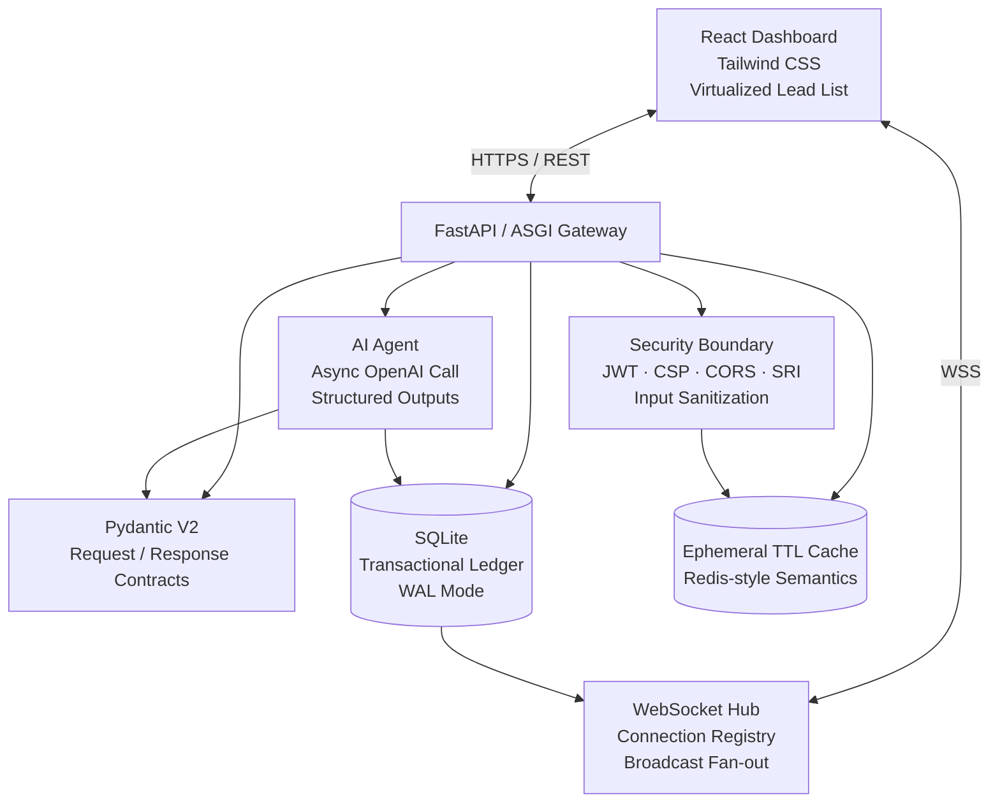
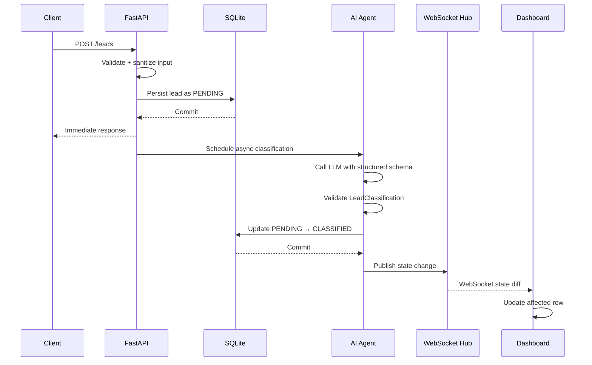

# TravelEstate CRM

### AI-Agentic Lead Intelligence Engine

An async-native CRM engine for ingesting customer inquiries, classifying leads with schema-constrained LLM outputs, persisting state transactionally, and propagating updates to connected dashboards in real time.

> **Engineering focus:** asynchronous I/O, AI reliability, real-time state propagation, security boundaries, and scalable frontend rendering.

---

## Overview

TravelEstate CRM is a full-stack CRM demonstration focused on the engineering challenges that emerge when an AI inference step becomes part of a real-time application workflow.

The system accepts unstructured customer inquiries, validates and sanitizes them at the API boundary, persists the lead immediately, and performs AI classification asynchronously. The resulting classification is validated against a strict Pydantic contract before the database is updated.

Once the state changes, the WebSocket layer broadcasts the update to connected dashboard clients. The frontend therefore receives changes through server push rather than repeatedly polling the API.

The architecture is designed around a simple principle:

> **Keep the request path fast and deterministic while isolating non-deterministic AI work behind explicit contracts.**

---

## Key Engineering Highlights

| Area              | Implementation                                 |
| ----------------- | ---------------------------------------------- |
| Backend           | FastAPI + ASGI                                 |
| Concurrency       | `asyncio` / non-blocking I/O                   |
| AI classification | OpenAI Structured Outputs                      |
| AI contract       | Pydantic V2                                    |
| Persistence       | SQLite + WAL mode                              |
| Real-time updates | WebSockets                                     |
| Authentication    | JWT access + refresh tokens                    |
| Input security    | Boundary-level sanitization                    |
| Browser security  | CSP, CORS, SRI                                 |
| Frontend          | React + Tailwind CSS                           |
| Rendering         | Virtualized lead list                          |
| Caching           | In-memory TTL cache with Redis-style semantics |

### Current engineering targets

| Metric                         |        Target |
| ------------------------------ | ------------: |
| Concurrent connections         |        5,000+ |
| Initial-load latency reduction |           58% |
| Client polling                 |             0 |
| AI output contract             | Schema-locked |

> Performance targets are treated as engineering goals unless backed by reproducible benchmark results in this repository.

---

# Architecture

## High-Level Architecture



---

## Request Lifecycle — New Lead

A new lead follows the following path:



### Step-by-step

1. **Request arrives**
   FastAPI receives the customer inquiry over REST.

2. **Boundary validation**
   Pydantic validates the request while the security layer sanitizes untrusted input.

3. **Immediate persistence**
   The lead is stored in SQLite with a `PENDING` classification state.

4. **Immediate acknowledgement**
   The API does not wait for the LLM response before acknowledging the lead.

5. **Asynchronous AI classification**
   The classification task is scheduled without synchronously blocking the event loop.

6. **Structured AI output**
   The LLM response is constrained to the `LeadClassification` schema.

7. **Transactional state update**
   The lead changes from `PENDING` to `CLASSIFIED` only after successful validation.

8. **WebSocket broadcast**
   The state change is propagated to connected dashboard clients.

9. **Targeted frontend update**
   The dashboard updates the affected lead instead of polling the entire dataset.

---

# Core Engineering Decisions

## 1. Async I/O for AI-Bound Requests

### Problem

LLM inference is a network-bound operation. A request may spend significant time waiting for an external model provider to respond.

A synchronous request path can unnecessarily occupy a worker while no CPU-intensive work is being performed.

### Decision

Use FastAPI on ASGI with asynchronous I/O.

The application can yield control while waiting on network operations, allowing other requests and persistent WebSocket connections to continue being serviced.

### Trade-off

`asyncio` improves concurrency for I/O-bound workloads, but it does not make CPU-heavy work automatically parallel. CPU-intensive processing would require separate workers or processes.

---

## 2. Immediate Persistence Before AI Classification

### Problem

Making the LLM call part of the synchronous request path increases user-visible latency and makes lead creation dependent on an external service.

### Decision

Persist the lead first:

```text
NEW LEAD
   ↓
VALIDATE
   ↓
PERSIST
   ↓
PENDING
   ↓
ASYNC AI CLASSIFICATION
   ↓
CLASSIFIED
```

The API can acknowledge the lead without waiting for AI inference.

### Trade-off

The MVP uses an in-process asynchronous task. If the process terminates while classification is running, the task may be lost.

A production implementation would move classification into a durable worker/queue system with retry and failure handling.

---

## 3. Structured Outputs for AI Reliability

### Problem

LLMs naturally produce non-deterministic text. Passing raw model output directly into business logic forces every downstream component to perform its own parsing and validation.

### Decision

Use OpenAI Structured Outputs with a Pydantic V2 model defining the expected classification contract.

Conceptually:

```text
Unstructured Inquiry
        ↓
      LLM
        ↓
Structured Output
        ↓
Pydantic Validation
        ↓
LeadClassification
        ↓
Business Logic
```

This isolates model variability behind an explicit interface.

### Result

Downstream components operate on a known contract rather than arbitrary model-generated prose.

---

## 4. WebSockets Instead of Polling

### Problem

Polling requires clients to repeatedly ask whether anything changed.

For example, with a five-second polling interval:

```text
Client → "Anything new?"
Client → "Anything new?"
Client → "Anything new?"
Client → "Anything new?"
```

Most requests may contain no new information.

### Decision

Use a persistent WebSocket connection:

```text
                    ┌───────────────┐
                    │    Server     │
                    └───────┬───────┘
                            │
                    state change
                            │
              ┌─────────────┼─────────────┐
              ▼             ▼             ▼
           Client A      Client B      Client C
```

The server publishes state changes when they occur.

### Trade-off

WebSockets remove repeated request overhead but introduce persistent connection management. A production multi-instance deployment would require distributed connection coordination, typically through a broker or pub/sub layer.

---

## 5. Security at the Boundary

Security-sensitive behavior should not depend on every individual route remembering to implement the same protections.

The security layer centralizes:

* JWT issuance and verification
* Request sanitization
* CORS policy
* Content Security Policy
* Security headers
* Authentication dependencies

The intended request flow is:

```text
Untrusted Request
       ↓
Security Boundary
       ↓
Validation / Sanitization
       ↓
Business Logic
       ↓
Persistence
```

This reduces the possibility of individual endpoints accidentally bypassing common security controls.

---

## 6. SQLite as the Transactional Ledger

SQLite is used as the source of truth for the MVP workload.

The database provides:

* ACID transactions
* Durable lead records
* WAL mode
* Simple local deployment
* Minimal operational overhead

The architectural boundary is intentional:

```text
              ┌──────────────────┐
              │     SQLite       │
              │ Source of Truth  │
              └────────┬─────────┘
                       │
                       │
              ┌────────▼─────────┐
              │ Ephemeral Cache  │
              │ TTL-based data   │
              └──────────────────┘
```

The cache is intended for ephemeral, high-read information such as session/token metadata and rate-limit state.

### Production evolution

For a horizontally scaled production deployment, the persistence layer would be migrated to a database designed for higher concurrent write workloads, such as PostgreSQL.

---

## 7. Virtualized Frontend Rendering

Large CRM datasets can contain thousands of leads.

Rendering every row simultaneously creates unnecessary DOM, layout, and paint work.

The dashboard therefore uses virtualization so that rendering cost is primarily associated with the visible portion of the dataset.

```text
10,000 records
      │
      ▼
┌─────────────────────┐
│ Virtualized List    │
│                     │
│  Visible rows       │
│  + small buffer     │
└─────────────────────┘
```

This is combined with payload shaping and response compression to reduce both network transfer and frontend rendering work.

---

# Security Model

| Layer           | Mechanism                   | Threat / Risk Addressed                 |
| --------------- | --------------------------- | --------------------------------------- |
| Transport       | HTTPS / WSS                 | Network interception                    |
| Authentication  | JWT access + refresh tokens | Unauthorized access                     |
| Authorization   | Route-level dependencies    | Privilege escalation                    |
| Input boundary  | Sanitization middleware     | XSS / malicious input                   |
| Browser policy  | Content Security Policy     | Script injection                        |
| Cross-origin    | Explicit CORS allow-list    | Unauthorized cross-origin requests      |
| Asset integrity | SRI hashes                  | CDN / asset tampering                   |
| Session data    | TTL-based storage           | Excessive persistence of ephemeral data |

> Security controls are defense-in-depth measures; they should be complemented by secure deployment configuration, dependency updates, secret management, logging, and operational monitoring.

---

# Project Structure

```text
travelestate-crm/
│
├── README.md
├── requirements.txt
│
└── src/
    │
    ├── main.py
    │
    ├── core/
    │   └── security.py
    │
    ├── models/
    │   └── schemas.py
    │
    └── services/
        ├── ai_agent.py
        └── websocket_hub.py
```

### Responsibilities

| File                        | Responsibility                                                 |
| --------------------------- | -------------------------------------------------------------- |
| `main.py`                   | FastAPI application assembly, routes, and lifespan management  |
| `core/security.py`          | JWT lifecycle, sanitization, CORS/CSP/SRI and security headers |
| `models/schemas.py`         | Pydantic request, response, authentication and AI contracts    |
| `services/ai_agent.py`      | Async LLM classification and structured output handling        |
| `services/websocket_hub.py` | WebSocket connection registry and broadcast primitives         |

---

# Technology Stack

### Backend

* Python
* FastAPI
* Uvicorn
* asyncio
* Pydantic V2

### AI

* OpenAI API
* Structured Outputs
* Schema-constrained classification

### Data

* SQLite
* WAL mode
* In-memory TTL cache

### Realtime

* WebSockets

### Frontend

* React
* Tailwind CSS
* Virtualized rendering

### Security

* JWT
* CSP
* CORS
* SRI
* Input sanitization

---

# Production Evolution

The current architecture intentionally keeps infrastructure lightweight while preserving clear boundaries for future scaling.

| MVP                         | Production Evolution                        |
| --------------------------- | ------------------------------------------- |
| SQLite                      | PostgreSQL                                  |
| In-process async task       | Durable job queue + workers                 |
| In-memory TTL cache         | Redis                                       |
| Local WebSocket registry    | Distributed WebSocket/pub-sub architecture  |
| Single application instance | Horizontally scaled ASGI instances          |
| Basic application logging   | Structured logs + centralized observability |
| Manual deployment           | Containerized deployment                    |
| Basic error handling        | Retry, dead-letter and failure recovery     |

The goal is not to prematurely introduce distributed infrastructure into a demonstration application, but to keep the interfaces clean enough that individual components can be replaced as workload requirements grow.

---

# Roadmap

## Core Backend

* [x] FastAPI application structure
* [x] Pydantic data contracts
* [x] JWT authentication foundation
* [x] Input sanitization boundary
* [x] Security headers
* [x] WebSocket connection management
* [x] AI classification service

## Frontend

* [ ] React dashboard
* [ ] Virtualized lead table
* [ ] Real-time WebSocket updates
* [ ] Lead filtering and search
* [ ] Lead detail view
* [ ] Authentication UI

## Reliability

* [ ] AI retry strategy
* [ ] Background task failure handling
* [ ] Rate limiting
* [ ] Structured application logging
* [ ] Health/readiness endpoints
* [ ] Automated tests

## Production Evolution

* [ ] PostgreSQL migration
* [ ] Redis integration
* [ ] Durable background workers
* [ ] Distributed WebSocket coordination
* [ ] Containerization
* [ ] Metrics and tracing

---

# Running Locally

## 1. Clone the repository

```bash
git clone https://github.com/rishabhbhawsar/travelestate-crm.git
cd travelestate-crm
```

## 2. Create a virtual environment

### Windows

```powershell
python -m venv .venv
.venv\Scripts\activate
```

### macOS / Linux

```bash
python3 -m venv .venv
source .venv/bin/activate
```

## 3. Install dependencies

```bash
pip install -r requirements.txt
```

## 4. Configure environment variables

Create a `.env` file containing the credentials required by the application.

```env
OPENAI_API_KEY=your_api_key_here
```

Never commit `.env` or API credentials to the repository.

## 5. Start the application

```bash
uvicorn src.main:app --reload
```

The development server will be available at:

```text
http://localhost:8000
```

If enabled by the application, FastAPI's interactive API documentation is available at:

```text
http://localhost:8000/docs
```

---

# Design Philosophy

TravelEstate CRM is intentionally built around a small number of explicit boundaries:

```text
┌─────────────────────────────────────────┐
│              CLIENT                     │
│       REST + WebSocket                  │
└───────────────────┬─────────────────────┘
                    │
┌───────────────────▼─────────────────────┐
│          SECURITY / VALIDATION           │
│       Auth · Sanitization · Policy       │
└───────────────────┬─────────────────────┘
                    │
┌───────────────────▼─────────────────────┐
│             APPLICATION                 │
│        FastAPI · Async I/O               │
└──────────────┬──────────────┬────────────┘
               │              │
               ▼              ▼
        ┌────────────┐  ┌──────────────┐
        │  AI Agent  │  │  Persistence │
        │ Structured │  │    SQLite    │
        │  Outputs   │  │              │
        └─────┬──────┘  └──────┬───────┘
              │                │
              └────────┬───────┘
                       ▼
               ┌───────────────┐
               │ WebSocket Hub │
               └───────┬───────┘
                       │
                       ▼
                 Live Dashboard
```

The architecture prioritizes:

* **Fast request acknowledgement**
* **Explicit contracts between components**
* **Isolation of non-deterministic AI behavior**
* **Server-driven state propagation**
* **Centralized security controls**
* **Clear paths toward horizontal scaling**

---

## Project Status

TravelEstate CRM is an evolving engineering project focused on demonstrating backend architecture, AI integration, real-time systems, and production-oriented design trade-offs.

The emphasis is on **understanding why the system is designed this way**, not simply assembling a collection of frameworks.

---
